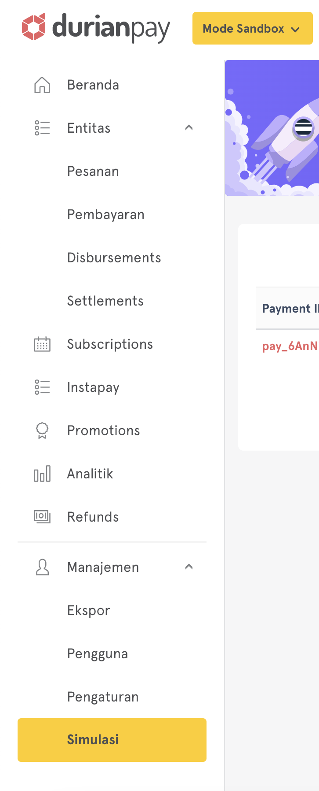

import {
  ExpansionPanel,
  ExpansionPanelList,
  ExpansionPanelListItem
} from 'gatsby-theme-apollo-docs';
import { Message } from 'theme-ui';

When you register with Durianpay, you will receive access to sandbox / testing environment which can be used for simulation and testing, all transactions made within sandbox mode are simulated hence it is completely safe 

## Simulating success/failure in sandbox mode

### Using API

To simulate the payment charge API flow in sandbox mode, merchants can use `dp_test_XXXXXXXXX` key. 

By default, the payment is kept on processing state for `VA`, `ewallet` and simulates the successful scenario for rest of the payment methods.

To simulate the failure/success scenario, you should use the Json field from  `sandbox_options` request. This contains `force_fail` and `delay_ms` fields. 

| Field |	Description |
| ------ | ------------ |
| _force_fail_ |	`bool` Make this field as true in the request if you want to simulate failure scenario and false if you want to simulate success scenario. |
| _delay_ms_ |	`integer` If you want to simulate a delay in making the payment as success or failed, give a value in milliseconds in this field in the request. |

>Note: Currently sandbox_options is supported for VA, E-Wallet, RetailStore and BNPL.

### Using Sandbox simulator

Use the [simulator](https://dashboard.durianpay.id/#/payment-simulator) built-in to the dashboard to test & explore VA & E-Wallet payment methods. Currently the dashboard simulation is available only for VA & E-Wallet payments.  

You can access the simulator by:  
1.  Login to the dashboard  
2.  Click on “Sandbox Simulator” option on the left menu  
3.  Test success and failure scenario as per your requirement 

How to use the simulator:  

1.  Create a transaction in sandbox mode  
2.  Open “Sandbox Simulator”  
3.  Select which status you want to simulate for the payment - `Success` or `failed`

